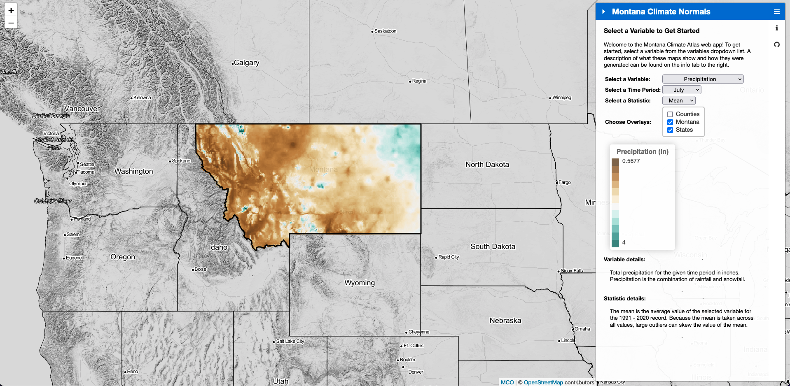

# Montana Climate Normals
`normals` is an R package that can be used to calculate climate normals using [gridMET](https://www.climatologylab.org/gridmet.html) climate data. Monthly and annual climate normals for the state of Montana are available in the [data/normals](data/normals) directory. An overview of how to use the package is available in [docs/climate_normals/make_normals.pdf](docs/climate_normals/make_normals.pdf). If you use our premade climate normals or use the `normals` package in a publication, please use the following citation:

*fill in*

The `normals` package was used to create and visualize Montana's climate normals for the 1991 - 2020 record on the Montana Climate Atlas. The atlas allows users to visualize average conditions of various climatological variables across Montana. An example screenshot showing mean July precipitation is attached below, and the full interactive application is available at [https://mt-climate-office.github.io/mt-normals/](https://mt-climate-office.github.io/mt-normals/). 

