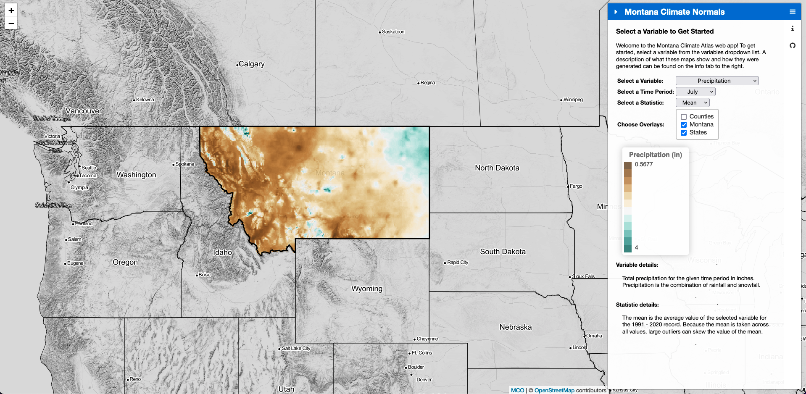

{ width=250px }

# Montana Climate Normals

The Montana Climate Office (MCO) has recently updated Montana's climate normals for the 1991 - 2020 record. The MCO has also developed a new Montana Climate Atlas that allows users to visualize average conditions of various climatological variables across Montana. The following links provide access to both maps and GeoTIFFs of the climate normals, the climate atlas, and the code used to generate normals:

- Climate normal maps: [https://data.climate.umt.edu/mt-normals/maps/](https://data.climate.umt.edu/mt-normals/maps/)
- Climate normal GeoTIFFs: [https://data.climate.umt.edu/mt-normals/cog/](https://data.climate.umt.edu/mt-normals/cog/)
- Climate atlas: [https://mt-climate-office.github.io/mt-normals/](https://mt-climate-office.github.io/mt-normals/)
- GitHub repository: [https://github.com/mt-climate-office/mt-normals](https://github.com/mt-climate-office/mt-normals)

 An example from the climate atlas showing mean July precipitation is attached below: 

